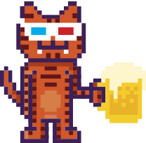

# BeerJS Vladivostok

The legendary frontend meetup is now in Vladivostok! :tada:

You can subscribe to notification by pressing Watch :eye: (Stars :star: are welcome too) 

All information about upcoming events is in issues

[beerjs-vl.ru](http://beerjs-vl.ru/)

## Who are We Waiting for, or Can I Join?
Literally, anyone, independently from place of work, place of living, sex, preferences or religion. Js - is all that matters. There are two rules only: respect others and don't forget to pay for yourself in pub

## A note about beer :beers:

BeerJS is about creating social spaces to strengthen software communities. There is no requirement to drink to participate.

## Releases

| Version | Place | Date|
| ------- | ----- | --- |
| 1-alpha | [Republic (Fresh Plaza)](https://2gis.ru/vladivostok/inside/3519072864070201/firm/3518965489890754?queryState=center%2F131.883177%2C43.119573%2Fzoom%2F17)|01 December 2018
| 2.0 | [BunkeR](https://vk.com/bunkercomm) | 23 Febuary 2019
| 3.0 | [BunkeR](https://vk.com/bunkercomm) | 03 May 2019
